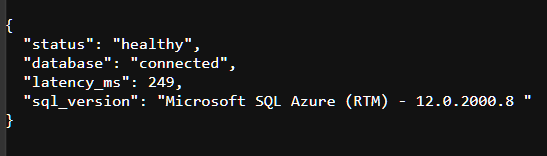
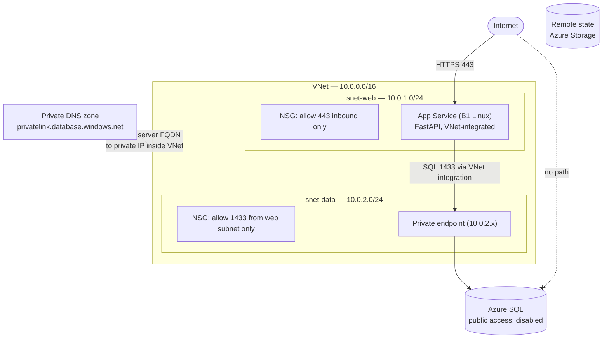
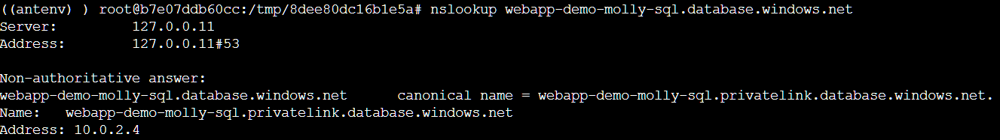
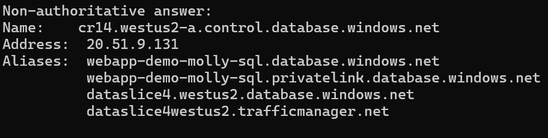

# Azure Web App — Infrastructure as Code

A modular Terraform deployment of a three-tier Azure environment: virtual network with least-privilege NSGs, a Python web app with VNet integration, and an Azure SQL database reachable only through a private endpoint. Everything is deployed through code — zero portal clicking.

Built incrementally as a portfolio project mapping to AZ-104 / AZ-305 / AZ-400 skills. The commit history reflects real development: each module lands as its own pull request.

**Live proof:** the app's `/health` endpoint opens a real connection to the database and reports the round-trip — a successful response exercises every layer below it (VNet integration → private DNS → private endpoint → SQL).



## Architecture



**The traffic asymmetry, on purpose:** the app is publicly reachable (that's its job), while its VNet integration provides *outbound* access into the VNet — which is how it reaches the database. The database has no internet path by two independent mechanisms: `public_network_access_enabled = false` at the server (no public endpoint exists at all) and an NSG rule permitting inbound 1433 only from the web subnet's CIDR. Public front door, private back end.

## Repository structure

```
├── app/
│   ├── main.py              # FastAPI app: / and /health (real DB round-trip)
│   └── requirements.txt
├── main.tf                  # Root config: providers, remote state backend, module calls
├── outputs.tf               # Pass-through of module outputs (sensitive values re-marked)
├── .terraform.lock.hcl      # Pinned provider versions (committed on purpose)
└── modules/
    ├── network/
    │   ├── main.tf          # VNet, subnets, NSGs, associations
    │   ├── variables.tf
    │   └── outputs.tf       # vnet_id, subnet IDs consumed by other modules
    ├── database/
    │   ├── main.tf          # SQL server + DB, private endpoint, private DNS zone
    │   ├── variables.tf
    │   └── outputs.tf       # FQDN, credentials & connection string (sensitive)
    └── app/
        ├── main.tf          # App Service plan + Linux web app, VNet integration
        ├── variables.tf
        └── outputs.tf       # app_url, app_name
```

Each tier is a self-contained module with a small contract: inputs in `variables.tf`, outputs in `outputs.tf`. The root `main.tf` only wires modules together — the app module consumes the network module's `web_subnet_id` and the database module's FQDN and credentials, so secrets flow module-to-module through Terraform and never touch a file.

## Design decisions

**Remote state from day one.** State lives in an Azure Storage account with blob-lease locking, not on my laptop. State can hold sensitive values (including the generated SQL password), so it never touches the repo and access to it is controlled.

**Defense in depth on the data tier.** Disabling public network access and restricting the NSG are independent controls — either alone blocks internet access to the database; together, a misconfiguration of one is caught by the other. Verified both directions: a connection attempt from the internet times out, while the app's health check succeeds in ~20–70 ms.

**Private DNS zone, because a private endpoint alone isn't enough.** SQL clients connect to `<server>.database.windows.net`, which by default resolves to a public IP even when a private endpoint exists. The `privatelink.database.windows.net` zone (exact name required) overrides resolution inside the VNet. Observable: `nslookup` of the server FQDN from inside the app answers with the private endpoint's `10.0.2.x` address; the same lookup from the internet gets a public answer.

**Same hostname, two answers — the private DNS zone at work:**

*From inside the app's console — the private zone intercepts and answers with the private endpoint:*



*The same lookup from the public internet — the chain continues to Microsoft's public gateway:*



**Credentials never exist outside Terraform.** The SQL admin password is generated in-config with `random_password` and flows to the app as an app setting via module outputs — never in a tfvars file, shell history, or the repo. Outputs carrying it are marked `sensitive`, so Terraform redacts them from plan/apply logs. Known limitation: app settings are visible to anyone with read access on the app; Key Vault references are the CI/CD-phase upgrade.


**Credentials never exist outside Terraform.** The SQL admin password is generated in-config with `random_password` and flows to the app as an app setting via module outputs — never in a tfvars file, shell history, or the repo. Outputs carrying it are marked `sensitive`, so Terraform redacts them from plan/apply logs. Known limitation: app settings are visible to anyone with read access on the app; Key Vault references are the CI/CD-phase upgrade.

**VNet integration pre-wired in the network module.** `snet-web` was delegated to `Microsoft.Web/serverFarms` before the app existed — App Service VNet integration requires it, and it's the most commonly missed prerequisite.

**pymssql over pyodbc.** pyodbc depends on a system ODBC driver being present on the host; pymssql installs with pip alone. For a health check, simpler and more portable wins.

**NSG source is the web subnet CIDR, not `VirtualNetwork`.** The built-in `VirtualNetwork` tag would let any future resource in the VNet reach the database. Scoping to `10.0.1.0/24` means only the web tier qualifies.

**No port 80 on the web tier.** `https_only` is enforced on the app and the NSG admits only 443 — no plaintext anywhere.

**Modules over one big file.** Each phase plugs into the outputs of existing modules instead of modifying them. If the root `main.tf` ever accumulates resources beyond the resource group, something belongs in a module.

## Getting started

Prerequisites: [Terraform ≥ 1.5](https://developer.hashicorp.com/terraform/install), [Azure CLI](https://learn.microsoft.com/en-us/cli/azure/install-azure-cli), an Azure subscription.

```bash
# Authenticate
az login

# One-time: bootstrap the state storage account
az group create --name rg-tfstate --location westus2
az storage account create --name <globally-unique-name> \
  --resource-group rg-tfstate --sku Standard_LRS \
  --allow-blob-public-access false
az storage container create --name tfstate \
  --account-name <globally-unique-name> --auth-mode login

# Update the backend block in main.tf with your storage account name, then:
terraform init
terraform plan     # expect: 16 to add
terraform apply    # SQL server is the slow one — allow ~10 minutes
```

Then deploy the application code onto the infrastructure:

```bash
# Zip only the app folder's contents (main.py at the zip root)
cd app && zip -r ../app.zip . && cd ..

az webapp deploy --resource-group rg-webapp-demo \
  --name <app-name> --src-path app.zip --type zip

az webapp config set --resource-group rg-webapp-demo \
  --name <app-name> \
  --startup-file "uvicorn main:app --host 0.0.0.0 --port 8000"
```

Visit `https://<app-name>.azurewebsites.net/health` — a `"database": "connected"` response verifies the full chain. Interactive API docs at `/docs`.

Tear down with `terraform destroy` — the state resource group is unmanaged and survives, so a full rebuild is one `apply` away (fresh SQL password, possibly a new private endpoint IP; nothing references either directly, so both are non-events). Redeploy the app zip after rebuilding.

## Cost

Roughly **$18/month** while deployed: B1 App Service plan ~$13, Basic-tier SQL ~$5; the network layer, private DNS, private endpoint, and state storage are free-to-pennies. Destroy between work sessions — rebuilding in minutes is the point of IaC.

## Roadmap

- [x] **Network module** — VNet, web/data subnets, least-privilege NSGs, remote state
- [x] **Database module** — Azure SQL exposed only through a private endpoint, with VNet-scoped private DNS
- [x] **App module** — App Service with VNet integration; `/health` endpoint proves the tiers connect
- [ ] **CI/CD** — Multi-stage Azure DevOps pipeline: validate + tfsec on PR, plan as reviewed artifact, apply gated behind manual approval
- [ ] **Observability & governance** — Azure Monitor alerts, Log Analytics, Azure Policy (require tags, deny public IPs in the data subnet)

Each phase lands as its own pull request.
