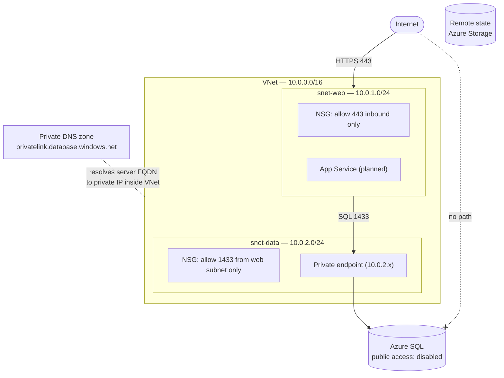

# Azure Web App — Infrastructure as Code

A modular Terraform deployment of a two-tier Azure environment: virtual network, least-privilege NSGs, and an Azure SQL database reachable only through a private endpoint. Everything is deployed through code — zero portal clicking.

Built incrementally as a portfolio project mapping to AZ-104 / AZ-305 / AZ-400 skills. The commit history reflects real development: each module lands as its own pull request.

## Architecture



The database has no internet path by two independent mechanisms: `public_network_access_enabled = false` at the server level (no public endpoint exists), and an NSG rule permitting inbound 1433 only from the web subnet's CIDR. The private endpoint in `snet-data` is the sole way in, and a private DNS zone makes the server's FQDN resolve to that endpoint's private IP for clients inside the VNet.

## Repository structure

```
├── main.tf                  # Root config: providers, remote state backend, module calls
├── outputs.tf               # Pass-through of module outputs (sensitive values re-marked)
├── .terraform.lock.hcl      # Pinned provider versions (committed on purpose)
└── modules/
    ├── network/
    │   ├── main.tf          # VNet, subnets, NSGs, associations
    │   ├── variables.tf
    │   └── outputs.tf       # vnet_id, subnet IDs consumed by other modules
    └── database/
        ├── main.tf          # SQL server + DB, private endpoint, private DNS zone
        ├── variables.tf
        └── outputs.tf       # FQDN, credentials & connection string (sensitive)
```

Each tier is a self-contained module with a small contract: inputs in `variables.tf`, outputs in `outputs.tf`. The root `main.tf` only wires modules together — the database module consumes `vnet_id` and `data_subnet_id` directly from the network module's outputs.

## Design decisions

**Remote state from day one.** State lives in an Azure Storage account with blob-lease locking, not on my laptop. State can hold sensitive values (including the generated SQL password), so it never touches the repo and access to it is controlled.

**Defense in depth on the data tier.** Disabling public network access and restricting the NSG are independent controls — either alone blocks internet access to the database; together, a misconfiguration of one is caught by the other.

**Private DNS zone, because a private endpoint alone isn't enough.** SQL clients connect to `<server>.database.windows.net`, which by default resolves to a public IP even when a private endpoint exists. The `privatelink.database.windows.net` zone (exact name required) overrides resolution inside the VNet so connections actually flow through the endpoint. This is the most commonly missed step in private endpoint setups.

**Credentials never exist outside Terraform.** The SQL admin password is generated in-config with `random_password` — never in a tfvars file, shell history, or the repo — and exposed only through outputs marked `sensitive`, which Terraform redacts from plan/apply logs. Key Vault integration is deferred to the CI/CD phase.

**NSG source is the web subnet CIDR, not `VirtualNetwork`.** The built-in `VirtualNetwork` tag would let any future resource in the VNet reach the database. Scoping to `10.0.1.0/24` means only the web tier qualifies.

**No port 80 on the web tier.** App Service handles the HTTP→HTTPS redirect, so there is no reason to accept plaintext at the network layer.

**Modules over one big file.** Each phase (app, monitoring) plugs into the outputs of existing modules instead of modifying them. If the root `main.tf` ever accumulates resources beyond the resource group, something belongs in a module.

## Getting started

Prerequisites: [Terraform ≥ 1.5](https://developer.hashicorp.com/terraform/install), [Azure CLI](https://learn.microsoft.com/en-us/cli/azure/install-azure-cli), an Azure subscription.

```bash
# Authenticate
az login

# One-time: bootstrap the state storage account
az group create --name rg-tfstate --location westus2
az storage account create --name <globally-unique-name> \
  --resource-group rg-tfstate --sku Standard_LRS \
  --allow-blob-public-access false
az storage container create --name tfstate \
  --account-name <globally-unique-name> --auth-mode login

# Update the backend block in main.tf with your storage account name, then:
terraform init
terraform plan     # expect: 14 to add
terraform apply    # SQL server is the slow one — allow ~10 minutes
```

Retrieve the generated database credentials with `terraform output -raw sql_admin_password`.

Tear down with `terraform destroy` — the state resource group is unmanaged and survives, so a full rebuild is one `apply` away (with a freshly generated password and possibly a new private endpoint IP; nothing references either directly, so both are non-events).

## Cost

Roughly **$5/month** while deployed: the Basic-tier SQL database is ~$5, the network layer (VNet, subnets, NSGs, private DNS) is free, and the private endpoint plus state storage are pennies. The App Service tier will add ~$13/month when it lands. Destroy between work sessions — rebuilding in minutes is the point of IaC.

## Roadmap

- [x] **Network module** — VNet, web/data subnets, least-privilege NSGs, remote state
- [x] **Database module** — Azure SQL exposed only through a private endpoint, with VNet-scoped private DNS
- [ ] **App module** — App Service with VNet integration, health endpoint reading from the database
- [ ] **CI/CD** — Multi-stage Azure DevOps pipeline: validate + tfsec on PR, plan as PR comment, gated apply
- [ ] **Observability & governance** — Azure Monitor alerts, Log Analytics, Azure Policy (require tags, deny public IPs in the data subnet)

Each phase lands as its own pull request.
