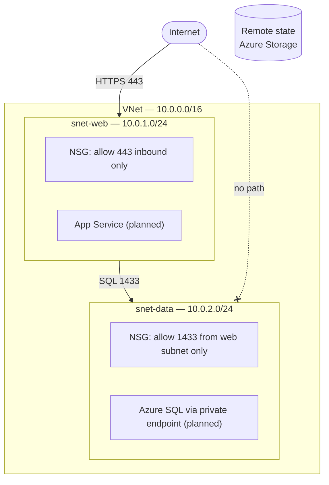

# Azure Web App — Infrastructure as Code

A modular Terraform deployment of a two-tier Azure environment: virtual network, least-privilege NSGs, and (coming next) an App Service with a private SQL backend. Everything is deployed through code — zero portal clicking.

Built incrementally as a portfolio project mapping to AZ-104 / AZ-305 / AZ-400 skills. The commit history reflects real development: each module lands as its own set of commits, and later additions arrive as pull requests.

## Architecture



The database tier is never internet-facing: its only allowed inbound traffic is SQL (1433) originating from the web subnet's CIDR. Both NSGs end with an explicit `DenyAllInbound` rule so intent is readable in code review, not just implied by Azure defaults.

## Repository structure

```
├── main.tf                  # Root config: provider, remote state backend, module calls
├── .terraform.lock.hcl      # Pinned provider versions (committed on purpose)
└── modules/
    └── network/
        ├── main.tf          # VNet, subnets, NSGs, associations
        ├── variables.tf     # Inputs with sane defaults
        └── outputs.tf       # Subnet IDs consumed by the app/database modules
```

Each tier is a self-contained module with a small contract: inputs in `variables.tf`, outputs in `outputs.tf`. The root `main.tf` only wires modules together. Adding the app tier later means adding a module call — not rewriting the network.

## Design decisions

**Remote state from day one.** State lives in an Azure Storage account with blob-lease locking, not on my laptop. This mirrors team workflows: state can hold sensitive values, so it never touches the repo (see `.gitignore`), and locking prevents two applies from colliding.

**NSG source is the web subnet CIDR, not `VirtualNetwork`.** Using the built-in `VirtualNetwork` tag would let *any* future resource in the VNet reach the database. Scoping to `10.0.1.0/24` means only the web tier qualifies — least privilege at the subnet level.

**No port 80 on the web tier.** App Service handles the HTTP→HTTPS redirect, so there is no reason to accept plaintext at the network layer.

**Subnet delegation is pre-wired.** `snet-web` is delegated to `Microsoft.Web/serverFarms` because App Service VNet integration requires it — the most common gotcha when the app tier arrives.

**Modules over one big file.** Slightly more ceremony now, but each subsequent phase (app, database, monitoring) plugs into the outputs of this one instead of modifying it.

## Getting started

Prerequisites: [Terraform ≥ 1.5](https://developer.hashicorp.com/terraform/install), [Azure CLI](https://learn.microsoft.com/en-us/cli/azure/install-azure-cli), an Azure subscription.

```bash
# Authenticate
az login

# One-time: bootstrap the state storage account
az group create --name rg-tfstate --location westus2
az storage account create --name <globally-unique-name> \
  --resource-group rg-tfstate --sku Standard_LRS \
  --allow-blob-public-access false
az storage container create --name tfstate \
  --account-name <globally-unique-name> --auth-mode login

# Update the backend block in main.tf with your storage account name, then:
terraform init
terraform plan     # expect: 8 to add
terraform apply
```

Tear down with `terraform destroy` — the state resource group is unmanaged and survives, so a rebuild is one `apply` away.

## Cost

The current network layer costs **$0/month** — VNets, subnets, and NSGs are free; the state storage account is pennies. Once the App Service and SQL tiers land, expect roughly **$15/month** on basic tiers. Destroy between work sessions; rebuilding in minutes is the point of IaC.

## Roadmap

- [x] **Network module** — VNet, web/data subnets, least-privilege NSGs, remote state
- [ ] **Database module** — Azure SQL exposed only through a private endpoint in `snet-data`
- [ ] **App module** — App Service with VNet integration, health endpoint reading from the database
- [ ] **CI/CD** — Multi-stage Azure DevOps pipeline: validate + tfsec on PR, plan as PR comment, gated apply
- [ ] **Observability & governance** — Azure Monitor alerts, Log Analytics, Azure Policy (require tags, deny public IPs in the data subnet)

Each phase lands as its own pull request.
