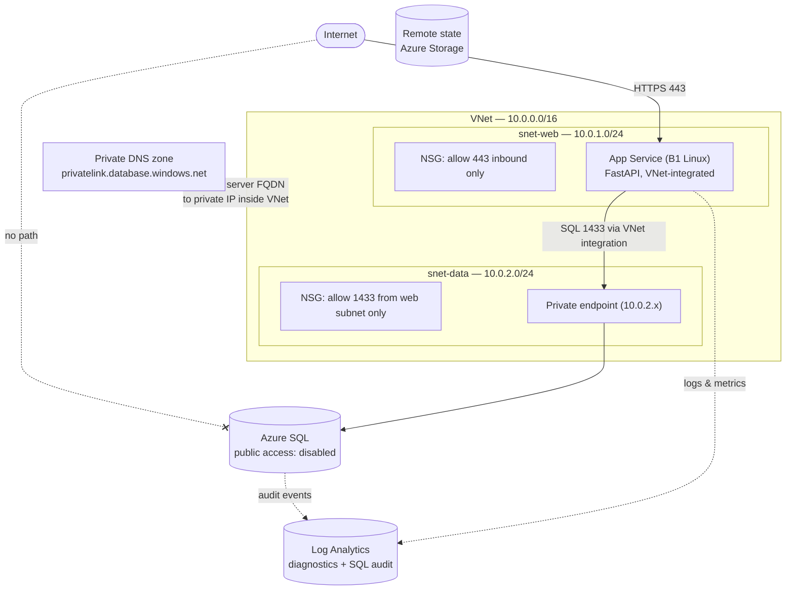
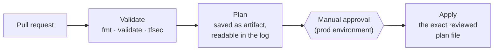
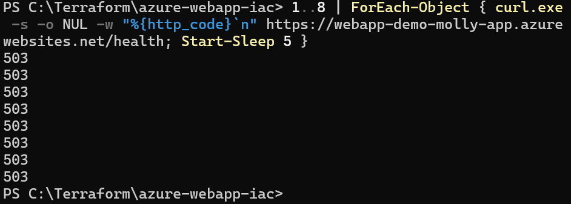
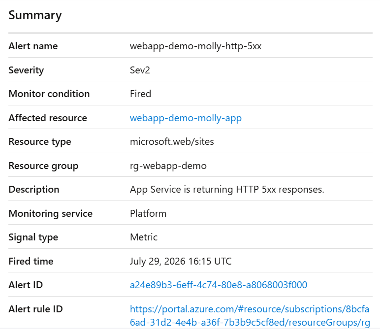
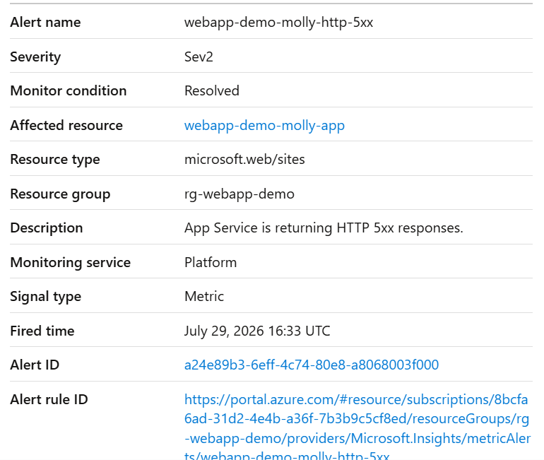

# Azure Web App — Infrastructure as Code

A modular Terraform deployment of a three-tier Azure environment — virtual network with least-privilege NSGs, a Python web app with VNet integration, and an Azure SQL database reachable only through a private endpoint — delivered through a multi-stage CI/CD pipeline with security scanning and approval-gated applies, and observed through Log Analytics, Azure Monitor alerts, and Azure Policy guardrails. Everything is deployed through code: zero portal clicking, zero laptop applies.

Built incrementally as a portfolio project mapping to AZ-104 / AZ-305 / AZ-400 skills. Each phase landed as its own pull request — the commit history is the development story.

**Live proof:** the app's `/health` endpoint opens a real connection to the database and reports the round-trip — a successful response exercises every layer below it (VNet integration → private DNS → private endpoint → SQL). When the database is unreachable, the endpoint returns HTTP 503, which feeds the monitoring layer's 5xx alert.

## Architecture


```mermaid
flowchart TB
    inet([Internet])

    subgraph vnet["VNet — 10.0.0.0/16"]
        subgraph web["snet-web — 10.0.1.0/24"]
            nsgw["NSG: allow 443 inbound only"]
            app["App Service (B1 Linux)<br/>FastAPI, VNet-integrated"]
        end
        subgraph data["snet-data — 10.0.2.0/24"]
            nsgd["NSG: allow 1433 from web subnet only"]
            pe["Private endpoint (10.0.2.x)"]
        end
    end

    sql[("Azure SQL<br/>public access: disabled")]
    dns["Private DNS zone<br/>privatelink.database.windows.net"]
    law[("Log Analytics<br/>diagnostics + SQL audit")]
    state[("Remote state<br/>Azure Storage")]

    inet -- "HTTPS 443" --> app
    app -- "SQL 1433 via VNet integration" --> pe
    pe --> sql
    dns -. "resolves server FQDN<br/>to private IP inside VNet" .- vnet
    app -. "logs & metrics" .-> law
    sql -. "audit events" .-> law
    inet -. "no path" .-x sql
```

**The traffic asymmetry, on purpose:** the app is publicly reachable (that's its job), while its VNet integration provides *outbound* access into the VNet — which is how it reaches the database. The database has no internet path by two independent mechanisms: `public_network_access_enabled = false` at the server (no public endpoint exists at all) and an NSG rule permitting inbound 1433 only from the web subnet's CIDR. Public front door, private back end.

## How changes ship

All infrastructure changes flow through the pipeline (`azure-pipelines.yml`) — a push to `main` cannot reach Azure without passing three stages:


```mermaid
flowchart LR
    pr[Pull request] --> v["Validate<br/>fmt · validate · tfsec"]
    v --> p["Plan<br/>saved as artifact,<br/>readable in the log"]
    p --> gate{{"Manual approval<br/>(prod environment)"}}
    gate --> a["Apply<br/>the exact reviewed<br/>plan file"]
```

- **Validate** — `terraform fmt -check`, `terraform validate`, and a tfsec security scan run on every pull request. A formatting difference or a security finding fails the build.
- **Plan** — `terraform plan` output is saved as a pipeline artifact and printed human-readable in the log for review.
- **Apply** — runs only on `main`, authenticates as a scoped service principal, waits for manual approval on the `prod` environment, and then applies **the exact plan file that was reviewed** — not a freshly generated one. What was approved is byte-for-byte what executes.

Pull requests run Validate + Plan only; the Apply stage cannot be reached from a branch.

## Observability & governance

- **Log Analytics workspace** collects App Service HTTP/console logs and diagnostics.
- **SQL audit logging** streams `SQLSecurityAuditEvents` from the server into the workspace — auditing is on at the server in log-monitoring mode, with no storage-account detour.
- **Azure Monitor alerts** watch two real operational signals — App Service HTTP 5xx count and sustained SQL DTU consumption — wired to an email action group. Verified with a deliberate fire drill: corrupting the app's DB credential produced 503s, tripped the alert, and the restore auto-resolved it.
- **Azure Policy** guardrails on the resource group: resources must carry a `project` tag, and network interfaces in the group may not have public IPs — so even a future Terraform mistake could not put a public IP in the data tier; the platform refuses.

**The drill, evidenced:**







A rebuild-from-zero note: metric alerts on freshly created resources can race Azure's metric-definition registration — observed as persistent 400 "metric not found" errors for roughly an hour after a full rebuild, resolving once the backend caught up. Alerts targeting brand-new resources may need patience or a delayed retry.

### The tfsec finding, start to finish

The security scan initially flagged the SQL server for missing audit configuration (`azure-database-enable-audit`, medium). Rather than bolting on a placeholder storage account, the finding was **deferred with an annotated inline ignore** explaining that audit logging belonged in the observability phase's Log Analytics workspace. When that phase landed, auditing was pointed at the workspace, the annotation was deleted, and the pipeline verified the closure. Detection → documented deferral → architectural resolution, all visible in commit history.

## Repository structure

```
├── app/
│   ├── main.py              # FastAPI app: / and /health (real DB round-trip; 503 when unhealthy)
│   └── requirements.txt
├── azure-pipelines.yml      # Multi-stage CI/CD: validate+tfsec → plan artifact → gated apply
├── main.tf                  # Root config: providers, remote state backend, module calls
├── outputs.tf               # Pass-through of module outputs (sensitive values re-marked)
├── .terraform.lock.hcl      # Pinned provider versions (committed on purpose)
├── images/                  # Verification screenshots
└── modules/
    ├── network/             # VNet, subnets, NSGs — vnet_id + subnet IDs out
    ├── database/            # SQL + private endpoint + private DNS — FQDN & credentials out (sensitive)
    ├── app/                 # App Service plan + web app, VNet integration — app_url/app_name out
    └── monitoring/          # Log Analytics, SQL auditing, diagnostics, action group, alerts
```

Each module keeps the same small contract: inputs in `variables.tf`, outputs in `outputs.tf`, and the root `main.tf` only wires modules together. Secrets flow module-to-module through Terraform outputs and never touch a file.

## Design decisions

**Remote state from day one.** State lives in an Azure Storage account with blob-lease locking, not on a laptop. State can hold sensitive values (including the generated SQL password), so it never touches the repo and access to it is controlled — the pipeline's service principal holds Storage Blob Data Contributor on that account specifically.

**Apply the reviewed plan, not a fresh one.** The pipeline saves the binary plan as an artifact in the Plan stage and applies that file in the Apply stage. Re-planning at apply time would mean executing changes nobody reviewed if anything shifted between stages.

**Pipeline identity: Contributor, never Owner.** The service principal is scoped Contributor on the subscription — it can manage resources but cannot grant roles or change access. Subscription scope (rather than the resource group) is deliberate: this project's Terraform creates and destroys the resource group itself, so an RG-scoped role assignment would be deleted with every destroy.

**Governance rights stay with humans — the bootstrap pattern.** Policy assignment requires rights beyond Contributor, but happens rarely. Rather than granting the pipeline standing governance power for an occasional act, policy assignments (like the state storage account before them) are a **one-time elevated bootstrap**: a human with Owner rights runs documented commands once. Trade-off, stated honestly: because Terraform recreates the resource group, the assignments must be re-run after a full destroy/rebuild. Occasional manual acts by a human beat standing privileges for the machine.

**Pinned tool versions, direct downloads.** Hosted build agents ship without Terraform, and tfsec's "install latest" script depends on a GitHub API call that rate-limits on shared agent IPs (observed failure, not hypothetical). The pipeline downloads pinned versions of both tools directly from release URLs — no API lookups, no image assumptions, reproducible runs.

**Security findings are triaged, not silenced.** tfsec runs at full sensitivity — any finding fails the build. The one finding this project produced was deferred with a reasoned annotation and later closed architecturally (see above); the gate never had its sensitivity lowered.

**Defense in depth on the data tier.** Disabling public network access and restricting the NSG are independent controls — either alone blocks internet access to the database. Verified both directions: a connection attempt from the internet times out, while the app's health check succeeds in ~20–70 ms.

**Private DNS zone, because a private endpoint alone isn't enough.** SQL clients connect to `<server>.database.windows.net`, which by default resolves to a public IP even when a private endpoint exists. The `privatelink.database.windows.net` zone (exact name required) overrides resolution inside the VNet. Observable: `nslookup` of the server FQDN from inside the app answers with the private endpoint's `10.0.2.x` address; the same lookup from the internet follows the CNAME chain on to Microsoft's public gateway.

**Credentials never exist outside Terraform.** The SQL admin password is generated in-config with `random_password` and flows to the app as an app setting via module outputs — never in a tfvars file, shell history, or the repo. Outputs carrying it are marked `sensitive`, so Terraform redacts them from plan/apply logs — including the pipeline's. After a destroy/rebuild, the app receives the newly generated password automatically through the same wiring — and rotation is one `terraform taint` of the password resource away.

**Health checks tell machines the truth.** `/health` returns 200 with timing when the database round-trip succeeds and **503** when it fails — the status code, not just the JSON body, carries the verdict, which is what load balancers and the 5xx alert key on. (The fire drill initially surfaced an older deployment returning 200 on failure — the alert correctly stayed silent, which is exactly why status codes matter.)

**Startup command lives in Terraform.** App Service's startup command was originally set via CLI after deploys — until resource recreation revealed it silently vanishing (App Service falls back to a placeholder app). It now lives in `site_config.app_command_line`, so rebuilt infrastructure is self-sufficient.

**VNet integration pre-wired in the network module.** `snet-web` was delegated to `Microsoft.Web/serverFarms` before the app existed — App Service VNet integration requires it, and it's the most commonly missed prerequisite.

**pymssql over pyodbc.** pyodbc depends on a system ODBC driver being present on the host; pymssql installs with pip alone. For a health check, simpler and more portable wins.

**NSG source is the web subnet CIDR, not `VirtualNetwork`.** The built-in `VirtualNetwork` tag would let any future resource in the VNet reach the database. Scoping to `10.0.1.0/24` means only the web tier qualifies.

**No port 80 on the web tier.** `https_only` is enforced on the app and the NSG admits only 443 — no plaintext anywhere.

**Modules over one big file.** Each phase plugged into the outputs of existing modules instead of modifying them. If the root `main.tf` ever accumulates resources beyond the resource group, something belongs in a module.

## Getting started

Prerequisites: [Terraform ≥ 1.5](https://developer.hashicorp.com/terraform/install), [Azure CLI](https://learn.microsoft.com/en-us/cli/azure/install-azure-cli), an Azure subscription.

```bash
# Authenticate
az login

# One-time: bootstrap the state storage account
az group create --name rg-tfstate --location westus2
az storage account create --name <globally-unique-name> \
  --resource-group rg-tfstate --sku Standard_LRS \
  --allow-blob-public-access false
az storage container create --name tfstate \
  --account-name <globally-unique-name> --auth-mode login

# Update the backend block in main.tf with your storage account name, then:
terraform init
terraform plan     # expect: ~23 to add
terraform apply    # SQL server is the slow one — allow ~10 minutes
```

Then deploy the application code onto the infrastructure:

```bash
# Zip only the app folder's contents (main.py at the zip root) — always fresh
cd app && zip -r ../app.zip . && cd ..

az webapp deploy --resource-group rg-webapp-demo \
  --name <app-name> --src-path app.zip --type zip
```

Visit `https://<app-name>.azurewebsites.net/health` — a `"database": "connected"` response verifies the full chain. Interactive API docs at `/docs`. (The startup command is managed by Terraform; no post-deploy configuration needed.)

To run the pipeline instead (the way changes actually ship here): an Azure DevOps project with a variable group `terraform-credentials` holding the service principal's `ARM_*` values, a `prod` environment with an approval check, and a pipeline pointing at `azure-pipelines.yml`. Policy guardrails are assigned by a one-time elevated bootstrap (documented commands, run with human credentials) after the environment exists.

Tear down with `terraform destroy` — the state resource group is unmanaged and survives, so a full rebuild is one approved pipeline run away. After rebuilding: redeploy the app zip, re-run the policy bootstrap (assignments die with the resource group — the documented trade-off of keeping governance rights away from the pipeline), and allow time for metric-definition registration before expecting alerts to create cleanly.

## Cost

Roughly **$18/month** while deployed: B1 App Service plan ~$13, Basic-tier SQL ~$5; Log Analytics ingestion at demo volumes, the network layer, private DNS, private endpoint, and state storage are free-to-pennies. Azure DevOps free tier covers the pipeline. Destroy between work sessions — rebuilding in minutes is the point of IaC.

## Project status

- [x] **Network module** — VNet, web/data subnets, least-privilege NSGs, remote state
- [x] **Database module** — Azure SQL exposed only through a private endpoint, with VNet-scoped private DNS
- [x] **App module** — App Service with VNet integration; `/health` endpoint proves the tiers connect
- [x] **CI/CD** — Multi-stage Azure DevOps pipeline: validate + tfsec on PRs, plan as reviewed artifact, apply gated behind manual approval
- [x] **Observability & governance** — Log Analytics, SQL audit logging (closed the deferred tfsec finding), Monitor alerts verified by fire drill, Azure Policy guardrails

**Possible future enhancements:** app-code deployment stage in the pipeline (zip deploy on merge — closes the recurring stale-code failure mode), Key Vault-backed pipeline secrets, a GitHub Actions port of the pipeline for side-by-side comparison, migration from tfsec to its successor Trivy.
